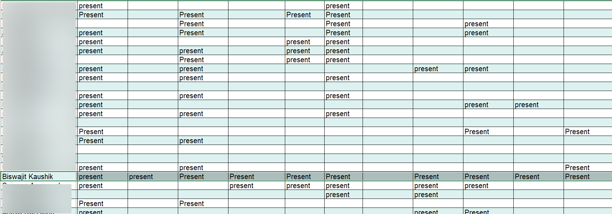

<!-- Improved compatibility of back to top link: See: https://github.com/othneildrew/Best-README-Template/pull/73 -->
<a name="readme-top"></a>
<!--
*** Thanks for checking out the Best-README-Template. If you have a suggestion
*** that would make this better, please fork the repo and create a pull request
*** or simply open an issue with the tag "enhancement".
*** Don't forget to give the project a star!
*** Thanks again! Now go create something AMAZING! :D
-->


<!-- PROJECT SHIELDS -->
<!--
*** I'm using markdown "reference style" links for readability.
*** Reference links are enclosed in brackets [ ] instead of parentheses ( ).
*** See the bottom of this document for the declaration of the reference variables
*** for contributors-url, forks-url, etc. This is an optional, concise syntax you may use.
*** https://www.markdownguide.org/basic-syntax/#reference-style-links
-->
[![Contributors][contributors-shield]][contributors-url]
[![Forks][forks-shield]][forks-url]
[![Stargazers][stars-shield]][stars-url]
[![Issues][issues-shield]][issues-url]
[![MIT License][license-shield]][license-url]
[![LinkedIn][linkedin-shield]][linkedin-url]


<!-- PROJECT LOGO -->
<br />
<div align="center">

<h3 align="center">Google Sheet Edit Notifier</h3>

  <p align="center">
    Get notified immediately if an edit is made to a Google Sheet
    <br />
    <a href="https://github.com/biswajit-k/google-sheet-edit-notifier"><strong>Explore the docs »</strong></a>

  </p>
</div>


<!-- TABLE OF CONTENTS -->
<details>
  <summary>Table of Contents</summary>
  <ol>
    <li>
      <a href="#about-the-project">About The Project</a>
      <ul>
        <li><a href="#built-with">Built With</a></li>
      </ul>
    </li>
    <li>
      <a href="#getting-started">Getting Started</a>
      <ul>
        <li><a href="#prerequisites">Prerequisites</a></li>
        <li><a href="#installation">Installation</a></li>
      </ul>
    </li>
    <li><a href="#usage">Usage</a></li>
    <li><a href="#roadmap">Roadmap</a></li>
    <li><a href="#contributing">Contributing</a></li>
    <li><a href="#license">License</a></li>
    <li><a href="#contact">Contact</a></li>
    <li><a href="#acknowledgments">Acknowledgments</a></li>
  </ol>
</details>


<!-- ABOUT THE PROJECT -->
## About The Project

[![Product Name Screen Shot][product-screenshot]](https://example.com)

Simple server that listens on provided Google Sheet for change and notifies you if an edit is made so you could take action immediately.

It mainly works by two python scripts:

* `app.py`: This file is used to retrieve your credentials(access and refresh token), which will allow the server to access the
Google Sheet. Your credentials will get stored in `.env` file automatically for easy and safer access.

* `scrapper.py`: This file runs the server that is going to monitor the Google Sheet for any changes and notifies you through a beep sound. However, You can customize the way you want to be notified.

### Project Inspiration

I made this project to mark my attendance in one of my courses during my college semester. 

Actually, I didn't had interest in that course and the professor had made attendance mandatory. Since there were large number of students in our batch, he used Google Sheet to record daily attendance for convinience. He had blocked edit access on the Google Sheet and would only open it at any random time during the class for 2 mins so that the students present in the class could mark their attendance.

So, instead of myself staring at the Sheet to check everytime if edit access has been opened by the professor, I used the server to monitor it. And it turned out really well. Below is a screenshot of my attendance-



<p align="right">(<a href="#readme-top">back to top</a>)</p>


### Built With

* [![Flask]][flask-url]
* [![Google Sheet]][google-sheet-url]
* [![OAuth]][oauth-url]


<p align="right">(<a href="#readme-top">back to top</a>)</p>


<!-- GETTING STARTED -->
## Getting Started

Follow the below instructions to get you local setup running.

### Prerequisites

On the Google Cloud Console, enable access to Google Sheet API and download the client secrets file. Follow the steps mentioned [here](https://developers.google.com/workspace/guides/get-started#5_steps_to_get_started) to get your credentials.

Copy the client secrets file you got in above step into the root folder and rename it to `client_secret.json`

Also, in the `.env` file add variable named `SHEET_ID` with the value as the Google Sheet ID. 

The sheet ID can be found from your Google Sheet link like below-

`https://docs.google.com/spreadsheets/d/{SHEET_ID}`

### Installation

1. Create a python environment and inside it install the dependencies:
   ```python
   pip install -r requirements.txt   
   ```

<p align="right">(<a href="#readme-top">back to top</a>)</p>


<!-- USAGE EXAMPLES -->
## Usage

With the client secrets file setup and dependencies installed, first run the `app.py` script. This will open a popup asking you to give read access to Google Sheet for your selected Google account. 

After you have granted the permissions, your credentials will automatically get stored in the `.env` file.

Next, run the `scrapper.py` file. It will continuously poll the Google Sheet for data in the provided range of cells. If any new data is added within the range. It will detect and notify immediately by playing a beep sound.

<p align="right">(<a href="#readme-top">back to top</a>)</p>


<!-- ROADMAP -->
## Future Scope

This is a simple server that monitors Google Sheets. This idea can further be extended for other Google APIs and also based on multiple scenarios that would cause some trigger.

This would create a complete automation system for your Google workspace.

<p align="right">(<a href="#readme-top">back to top</a>)</p>


<!-- CONTRIBUTING -->
## Contributing

Contributions are what make the open source community such an amazing place to learn, inspire, and create. Any contributions you make are **greatly appreciated**.

If you have a suggestion that would make this better, please fork the repo and create a pull request. You can also simply open an issue with the tag "enhancement".
Don't forget to give the project a star! Thanks again!

1. Fork the Project
2. Create your Feature Branch (`git checkout -b feature/AmazingFeature`)
3. Commit your Changes (`git commit -m 'Add some AmazingFeature'`)
4. Push to the Branch (`git push origin feature/AmazingFeature`)
5. Open a Pull Request

<p align="right">(<a href="#readme-top">back to top</a>)</p>


<!-- LICENSE -->
## License

Distributed under the MIT License. See `LICENSE.txt` for more information.

<p align="right">(<a href="#readme-top">back to top</a>)</p>


<!-- CONTACT -->
## Contact

Biswajit Kaushik - [@speedo_sorted](https://twitter.com/speedo_sorted) - biswajitkaushik02@gmail.com

Project Link: [https://github.com/biswajit-k/google-sheet-edit-notifier](https://github.com/biswajit-k/google-sheet-edit-notifier)

<p align="right">(<a href="#readme-top">back to top</a>)</p>


<!-- ACKNOWLEDGMENTS -->
## Acknowledgments

* [Getting Started | Google Workspace](https://developers.google.com/workspace/guides/get-started)

<p align="right">(<a href="#readme-top">back to top</a>)</p>


<!-- MARKDOWN LINKS & IMAGES -->
<!-- https://www.markdownguide.org/basic-syntax/#reference-style-links -->
[contributors-shield]: https://img.shields.io/github/contributors/biswajit-k/google-sheet-edit-notifier.svg?style=for-the-badge
[contributors-url]: https://github.com/biswajit-k/google-sheet-edit-notifier/graphs/contributors
[forks-shield]: https://img.shields.io/github/forks/biswajit-k/google-sheet-edit-notifier.svg?style=for-the-badge
[forks-url]: https://github.com/biswajit-k/google-sheet-edit-notifier/network/members
[stars-shield]: https://img.shields.io/github/stars/biswajit-k/google-sheet-edit-notifier.svg?style=for-the-badge
[stars-url]: https://github.com/biswajit-k/google-sheet-edit-notifier/stargazers
[issues-shield]: https://img.shields.io/github/issues/biswajit-k/google-sheet-edit-notifier.svg?style=for-the-badge
[issues-url]: https://github.com/biswajit-k/google-sheet-edit-notifier/issues
[license-shield]: https://img.shields.io/github/license/biswajit-k/google-sheet-edit-notifier.svg?style=for-the-badge
[license-url]: https://github.com/biswajit-k/google-sheet-edit-notifier/blob/master/LICENSE.txt
[linkedin-shield]: https://img.shields.io/badge/-LinkedIn-black.svg?style=for-the-badge&logo=linkedin&colorB=555
[linkedin-url]: https://linkedin.com/in/biswajit-kaushik
[product-screenshot]: images/screenshot.png
[Next.js]: https://img.shields.io/badge/next.js-000000?style=for-the-badge&logo=nextdotjs&logoColor=white
[Next-url]: https://nextjs.org/
[React.js]: https://img.shields.io/badge/React-20232A?style=for-the-badge&logo=react&logoColor=61DAFB
[React-url]: https://reactjs.org/
[Vue.js]: https://img.shields.io/badge/Vue.js-35495E?style=for-the-badge&logo=vuedotjs&logoColor=4FC08D
[Vue-url]: https://vuejs.org/
[Angular.io]: https://img.shields.io/badge/Angular-DD0031?style=for-the-badge&logo=angular&logoColor=white
[Angular-url]: https://angular.io/
[Svelte.dev]: https://img.shields.io/badge/Svelte-4A4A55?style=for-the-badge&logo=svelte&logoColor=FF3E00
[Svelte-url]: https://svelte.dev/
[Laravel.com]: https://img.shields.io/badge/Laravel-FF2D20?style=for-the-badge&logo=laravel&logoColor=white
[Laravel-url]: https://laravel.com
[Bootstrap.com]: https://img.shields.io/badge/Bootstrap-563D7C?style=for-the-badge&logo=bootstrap&logoColor=white
[Bootstrap-url]: https://getbootstrap.com
[JQuery.com]: https://img.shields.io/badge/jQuery-0769AD?style=for-the-badge&logo=jquery&logoColor=white
[JQuery-url]: https://jquery.com 
[Flask]: https://img.shields.io/badge/flask-%23000.svg?style=for-the-badge&logo=flask
[flask-url]: https://flask.palletsprojects.com/
[Google Sheet]: https://img.shields.io/badge/google%20sheets%20api-1f9f61?style=for-the-badge&logo=Manjaro&logoColor=white
[google-sheet-url]: https://developers.google.com/sheets/api/guides/concepts
[OAuth]: https://img.shields.io/badge/OAuth%202.0-%23000.svg?style=for-the-badge
[oauth-url]: https://oauth.net/2/